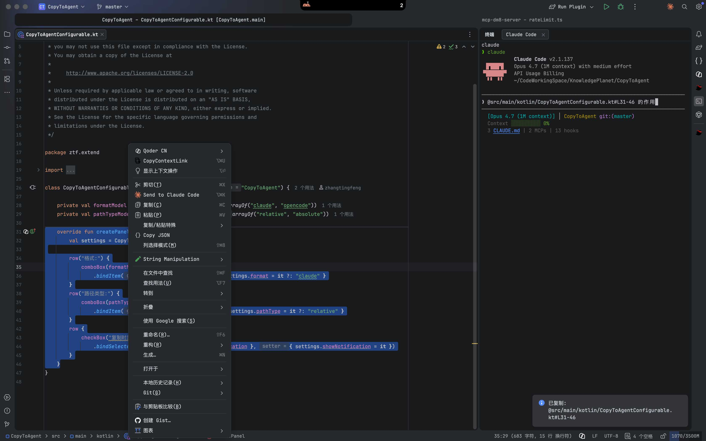

# CopyToAgent

[](LICENSE)
[](https://plugins.jetbrains.com)

将文件路径和行号引用复制到剪贴板，格式兼容 Claude、OpenCode 等 AI 编程助手。



## 功能特性

- 从编辑器复制文件路径及行号引用（如 `@src/Main.kt#L10-20`）
- 支持两种格式：
  - **Claude**: `@path/file#L10-20`
  - **OpenCode**: `@path/file#10-20`
- 相对路径或绝对路径模式
- 无选区时仅复制文件路径（不含行号）
- 可配置复制时是否弹出通知

## 安装

### 从 JetBrains Marketplace 安装

1. 打开 **设置 → 插件 → Marketplace**
2. 搜索 **Copy To Agent**
3. 点击 **安装**

### 手动安装

1. 从 [Releases](https://github.com/baibaibaixiong23/CopyToAgent/releases) 下载 `.zip` 文件
2. 打开 **设置 → 插件 → ⚙️ → 从磁盘安装插件...**
3. 选择下载的文件

## 使用方法

1. 在编辑器中打开文件
2. （可选）选中代码行
3. 按 **Ctrl+Alt+U**（或右键 → **Copy Context Link**）
4. 粘贴到 AI 助手中

### 示例

| 选区情况 | 复制内容（Claude 格式） |
|----------|------------------------|
| 无选区 | `@src/Main.kt` |
| 单行（第 5 行） | `@src/Main.kt#L5` |
| 第 10-20 行 | `@src/Main.kt#L10-20` |

## 配置

**设置 → 工具 → CopyToAgent**

| 选项 | 可选值 | 默认值 | 说明 |
|------|--------|--------|------|
| 格式 | `claude`, `opencode` | `claude` | 行号引用格式 |
| 路径类型 | `relative`, `absolute` | `relative` | 相对于项目根目录或绝对路径 |
| 显示通知 | 复选框 | 关闭 | 复制时是否弹出气泡通知 |

> 修改配置后需重启 IDE 生效。

## 从源码构建

```bash
# 设置 JDK 21 路径（根据你的环境调整）
export JAVA_HOME=/path/to/jdk-21

# 构建插件
./gradlew buildPlugin

# 运行沙盒 IDE 测试
./gradlew runIde

# 运行测试
./gradlew test

# 验证插件兼容性
./gradlew verifyPlugin
```

构建产物位于 `build/distributions/` 目录。

## 许可证

本项目基于 [Apache License 2.0](LICENSE) 开源。
